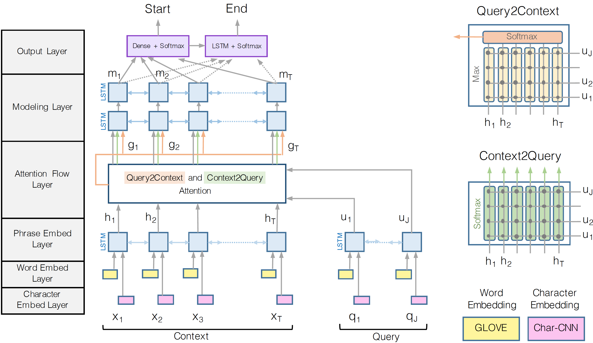

## Binary Question Answering with PyTorch

This project is an implementation of binary question answering using PyTorch, MLflow for model versioning, and Docker for containerization. 
The objective of this project is to create a binary question answering model that can answer yes/no questions based on the given question and a context text.

*Image source:https://allenai.github.io/bi-att-flow/* 
